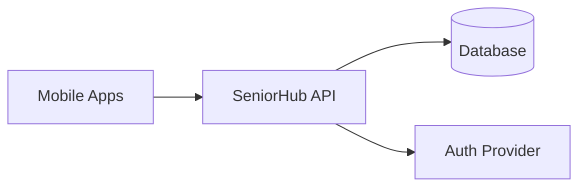
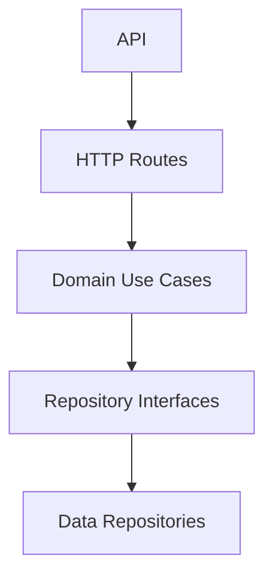
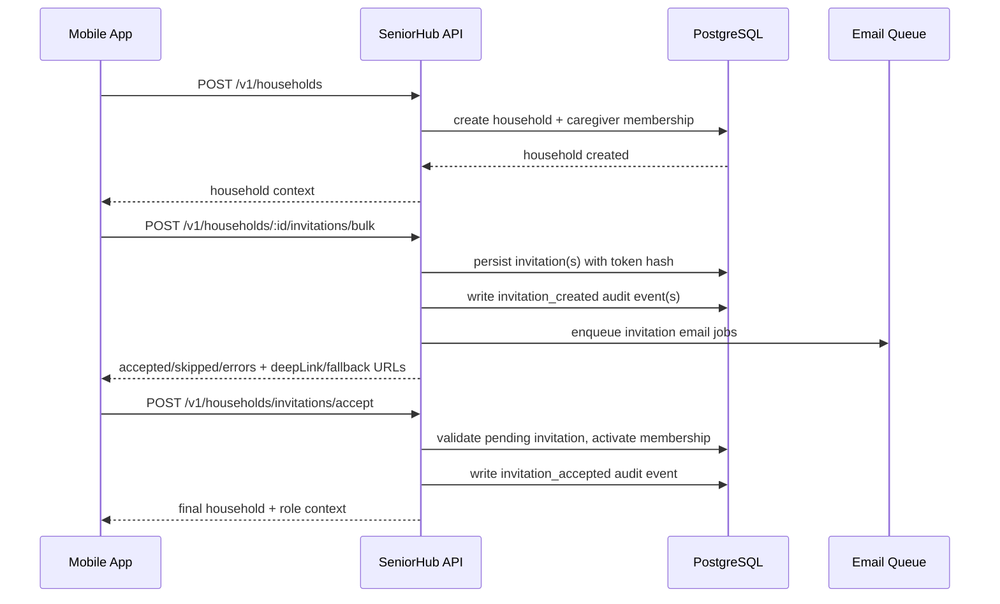

# ARCHITECTURE.md

## 1. Technical vision

`seniorhub` is a backend platform that powers data sharing across members of the same household (senior, caregiver, relatives, trusted contacts).

## 2. Core principles

- strict layer separation (`api`, `domain`, `data`)
- domain-driven business rules for access and sharing
- explicit household scoping for all sensitive resources
- testability and maintainability from day one
- secure-by-default design for personal/health-related data

## 3. Target system context



## 4. API decomposition (initial)



### 4.1 Layer responsibilities

- `routes`: transport-only logic (HTTP parse/validate/map), no business rules
- `domain/usecases`: access control decisions and business orchestration
- `domain/repositories`: abstract ports for persistence and external data
- `data/repositories`: concrete implementations behind ports

### 4.2 Contract and DTO policy

- request and response DTOs must remain explicit and stable
- contract changes must be documented in `CHANGELOG.md`
- sensitive fields must never be returned unless explicitly required and authorized

## 5. Functional modules (initial)

- `households`: create/read households
- `members`: manage household membership and roles
- `shared-overview`: retrieve shared household dashboard data

## 6. Initial API flow: household shared overview

1. Client calls `GET /v1/households/:householdId/overview`
2. Route validates input and context
3. Use-case checks membership and role eligibility
4. Repository fetches household + members
5. API returns safe aggregated DTO

## 7. Security and privacy constraints

- every household resource access must validate membership
- no cross-household access is allowed
- only minimal required data is returned in overview endpoints
- errors must avoid leaking sensitive internals

## 8. Quality constraints

- mandatory quality command: `cd api && npm run quality:check`
- mutation endpoints must include explicit Zod payload validation
- household membership checks are mandatory in use-cases for protected resources

## 9. Near-term decisions

- persistence is implemented with a driver switch:
  - `in-memory` for lightweight local development
  - `postgres` for persistent household/membership/invitation data
- auth integration strategy (JWT/session)
- audit trail model for sensitive mutations

## 10. Persistence and migrations

- DB access is encapsulated in `data/repositories/PostgresHouseholdRepository.ts`
- runtime repository selection is handled by `data/repositories/createHouseholdRepository.ts`
- PostgreSQL schema is versioned in `api/migrations/*.sql`
- migration execution uses `npm run migrate` and stores applied versions in `schema_migrations`

## 11. Onboarding sequence (create household, invite, accept)



## 12. Contracts and observability

- OpenAPI is generated and exposed through Fastify Swagger (`/docs`, `/documentation/json`)
- invitation email delivery metrics are exposed at `GET /v1/observability/invitations/email-metrics`
- audit events are persisted in `audit_events` for invitation create/accept/cancel actions

## 13. Route module structure (refactored)

Routes are organized by domain in modular subdirectories following SRP:

```
api/src/routes/households/
├── index.ts                  # Plugin entry point, dependency injection
├── schemas.ts                # Zod and JSON Schema definitions
├── utils.ts                  # Shared utilities (rate limiting, sanitization)
├── householdRoutes.ts        # Household CRUD endpoints
├── invitationRoutes.ts       # Invitation lifecycle endpoints
├── observabilityRoutes.ts    # Metrics and monitoring endpoints
└── README.md                 # Module documentation
```

**Benefits:**
- Single Responsibility: each file has one clear purpose
- Maintainability: smaller, focused files easier to navigate
- Testability: utilities and schemas testable independently
- Scalability: clear pattern for adding new domains

## 14. Repository structure and helpers

Database repositories share common helpers to eliminate duplication:

```
api/src/data/repositories/
├── postgres/
│   └── helpers.ts            # Shared DB utilities (mappers, normalizers)
├── PostgresHouseholdRepository.ts
├── InMemoryHouseholdRepository.ts
└── createHouseholdRepository.ts
```

**Helpers include:**
- Date/time utilities (`nowIso`, `toIso`, `addHours`)
- Normalization functions (`normalizeEmail`, `normalizeName`)
- Security utilities (`hashToken`)
- Database row mappers (`mapMember`, `mapInvitation`)

This structure reduces code duplication and centralizes data transformation logic.
