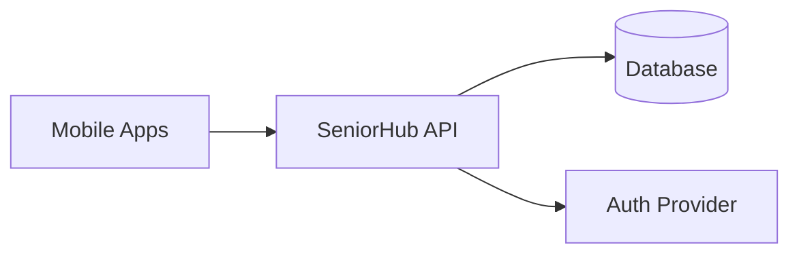
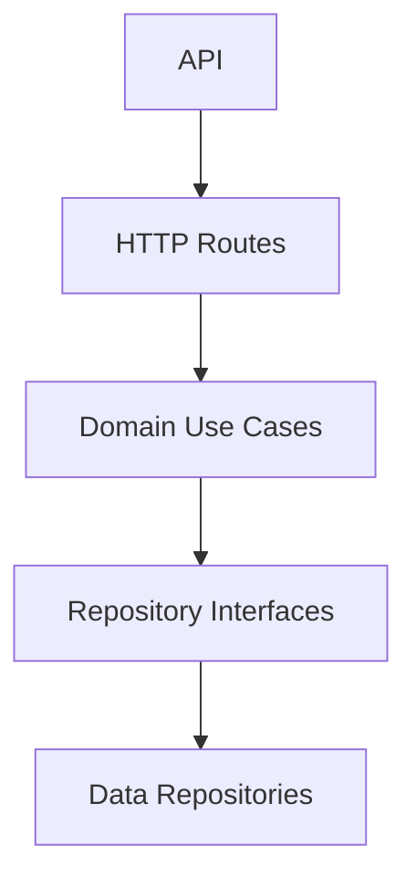

# ARCHITECTURE.md

## 1. Technical vision

`seniorhub` is a backend platform that powers data sharing across members of the same household (senior, caregiver, relatives, trusted contacts).

## 2. Core principles

- strict layer separation (`api`, `domain`, `data`)
- domain-driven business rules for access and sharing
- explicit household scoping for all sensitive resources
- testability and maintainability from day one
- secure-by-default design for personal/health-related data

## 3. Target system context

## 4. API decomposition (initial)

### 4.1 Layer responsibilities

- `routes`: transport-only logic (HTTP parse/validate/map), no business rules
- `domain/usecases`: access control decisions and business orchestration
- `domain/repositories`: abstract ports for persistence and external data
- `data/repositories`: concrete implementations behind ports

### 4.2 Contract and DTO policy

- request and response DTOs must remain explicit and stable
- contract changes must be documented in `CHANGELOG.md`
- sensitive fields must never be returned unless explicitly required and authorized

## 5. Functional modules (initial)

- `households`: create/read households
- `members`: manage household membership and roles
- `shared-overview`: retrieve shared household dashboard data

## 6. Initial API flow: household shared overview

1. Client calls `GET /v1/households/:householdId/overview`
2. Route validates input and context
3. Use-case checks membership and role eligibility
4. Repository fetches household + members
5. API returns safe aggregated DTO

## 7. Security and privacy constraints

- every household resource access must validate membership
- no cross-household access is allowed
- only minimal required data is returned in overview endpoints
- errors must avoid leaking sensitive internals

## 8. Quality constraints

- mandatory quality command: `cd api && npm run quality:check`
- mutation endpoints must include explicit Zod payload validation
- household membership checks are mandatory in use-cases for protected resources

## 9. Near-term decisions

- persistence is implemented with a driver switch:
  - `in-memory` for lightweight local development
  - `postgres` for persistent household/membership/invitation data
- auth integration strategy (JWT/session)
- audit trail model for sensitive mutations

## 10. Persistence and migrations

- DB access is encapsulated in `data/repositories/PostgresHouseholdRepository.ts`
- runtime repository selection is handled by `data/repositories/createHouseholdRepository.ts`
- PostgreSQL schema is versioned in `api/migrations/*.sql`
- migration execution uses `npm run migrate` and stores applied versions in `schema_migrations`
