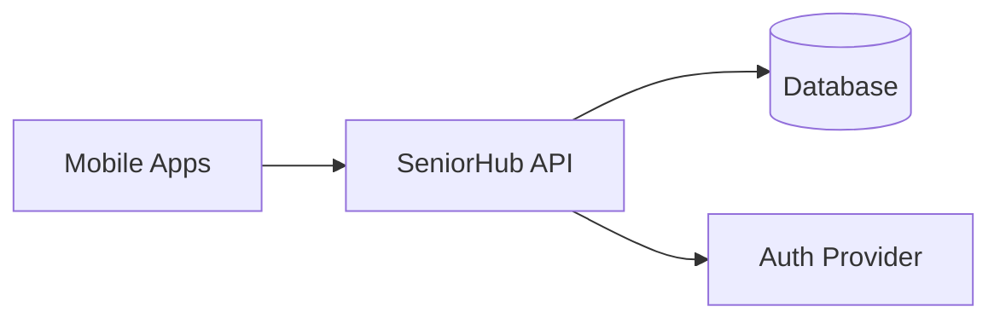
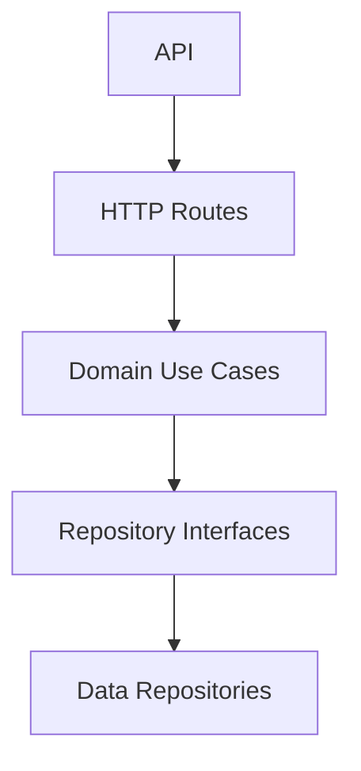
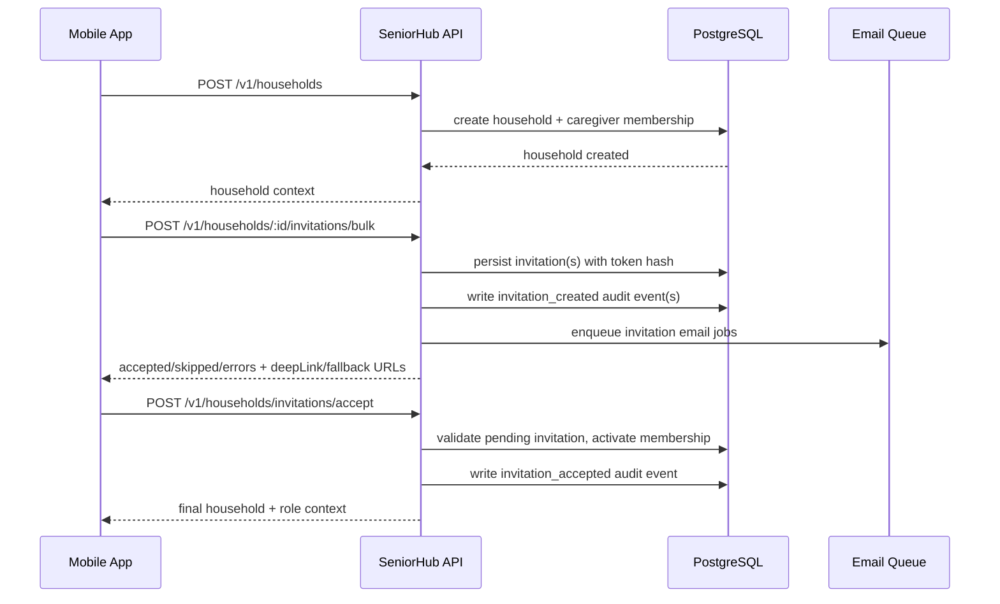
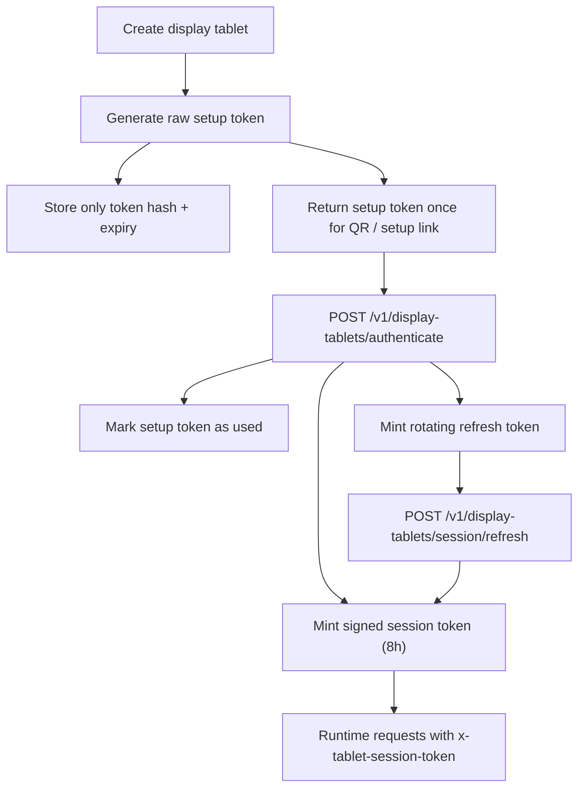
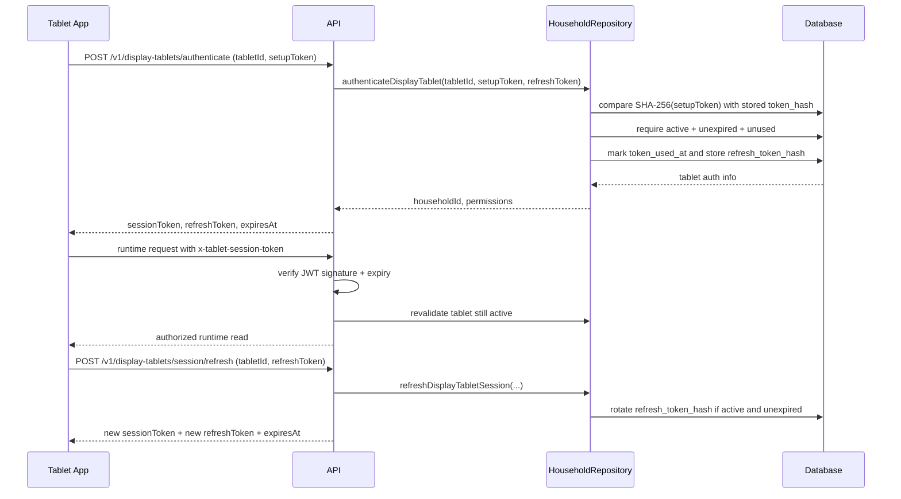
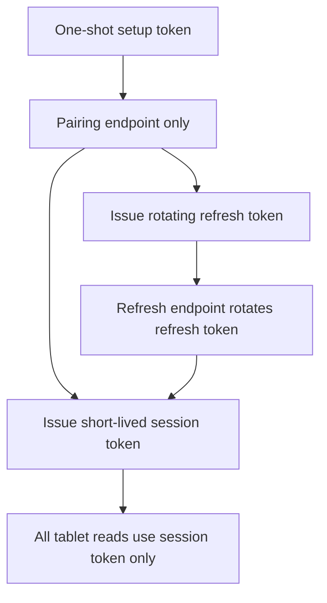

# ARCHITECTURE.md

## 1. Technical vision

`seniorhub` is a backend platform that powers data sharing across members of the same household (senior, caregiver, relatives, trusted contacts).

## 2. Core principles

- strict layer separation (`api`, `domain`, `data`)
- domain-driven business rules for access and sharing
- explicit household scoping for all sensitive resources
- testability and maintainability from day one
- secure-by-default design for personal/health-related data

## 3. Target system context


```mermaid
flowchart LR
  M[Mobile Apps]
  API[SeniorHub API]
  DB[(Database)]
  AUTH[Auth Provider]

  M --> API
  API --> DB
  API --> AUTH
```

## 4. API decomposition (initial)


```mermaid
flowchart TB
  API --> Routes[HTTP Routes]
  Routes --> UseCases[Domain Use Cases]
  UseCases --> RepoPorts[Repository Interfaces]
  RepoPorts --> DataRepos[Data Repositories]
```

### 4.1 Layer responsibilities

- `routes`: transport-only logic (HTTP parse/validate/map), no business rules
- `domain/usecases`: access control decisions and business orchestration
- `domain/repositories`: abstract ports for persistence and external data
- `data/repositories`: concrete implementations behind ports

### 4.2 Contract and DTO policy

- request and response DTOs must remain explicit and stable
- contract changes must be documented in `CHANGELOG.md`
- sensitive fields must never be returned unless explicitly required and authorized

## 5. Functional modules (initial)

- `households`: create/read households
- `members`: manage household membership and roles
- `shared-overview`: retrieve shared household dashboard data

## 6. Initial API flow: household shared overview

1. Client calls `GET /v1/households/:householdId/overview`
2. Route validates input and context
3. Use-case checks membership and role eligibility
4. Repository fetches household + members
5. API returns safe aggregated DTO

## 7. Security and privacy constraints

- every household resource access must validate membership
- no cross-household access is allowed
- only minimal required data is returned in overview endpoints
- errors must avoid leaking sensitive internals

## 8. Quality constraints

- mandatory quality command: `cd api && npm run quality:check`
- mutation endpoints must include explicit Zod payload validation
- household membership checks are mandatory in use-cases for protected resources

## 9. Near-term decisions

- persistence is implemented with a driver switch:
  - `in-memory` for lightweight local development
  - `postgres` for persistent household/membership/invitation data
- auth integration strategy (JWT/session)
- audit trail model for sensitive mutations

## 10. Persistence and migrations

- DB access is encapsulated in `data/repositories/PostgresHouseholdRepository.ts`
- runtime repository selection is handled by `data/repositories/createHouseholdRepository.ts`
- PostgreSQL schema is versioned in `api/migrations/*.sql`
- migration execution uses `npm run migrate` and stores applied versions in `schema_migrations`

## 11. Onboarding sequence (create household, invite, accept)


```mermaid
sequenceDiagram
  participant M as Mobile App
  participant API as SeniorHub API
  participant DB as PostgreSQL
  participant Q as Email Queue

  M->>API: POST /v1/households
  API->>DB: create household + caregiver membership
  DB-->>API: household created
  API-->>M: household context

  M->>API: POST /v1/households/:id/invitations/bulk
  API->>DB: persist invitation(s) with token hash
  API->>DB: write invitation_created audit event(s)
  API->>Q: enqueue invitation email jobs
  API-->>M: accepted/skipped/errors + deepLink/fallback URLs

  M->>API: POST /v1/households/invitations/accept
  API->>DB: validate pending invitation, activate membership
  API->>DB: write invitation_accepted audit event
  API-->>M: final household + role context
```

## 12. Contracts and observability

- OpenAPI is generated and exposed through Fastify Swagger (`/docs`, `/documentation/json`)
- invitation email delivery metrics are exposed at `GET /v1/observability/invitations/email-metrics`
- audit events are persisted in `audit_events` for invitation create/accept/cancel actions

## 13. Route module structure (refactored)

Routes are organized by domain in modular subdirectories following SRP:

```
api/src/routes/households/
├── index.ts                  # Plugin entry point, dependency injection
├── schemas.ts                # Zod and JSON Schema definitions
├── utils.ts                  # Shared utilities (rate limiting, sanitization)
├── householdRoutes.ts        # Household CRUD endpoints
├── invitationRoutes.ts       # Invitation lifecycle endpoints
├── observabilityRoutes.ts    # Metrics and monitoring endpoints
└── README.md                 # Module documentation
```

**Benefits:**
- Single Responsibility: each file has one clear purpose
- Maintainability: smaller, focused files easier to navigate
- Testability: utilities and schemas testable independently
- Scalability: clear pattern for adding new domains

## 14. Repository structure and helpers

Database repositories share common helpers to eliminate duplication:

```
api/src/data/repositories/
├── postgres/
│   └── helpers.ts            # Shared DB utilities (mappers, normalizers)
├── PostgresHouseholdRepository.ts
├── InMemoryHouseholdRepository.ts
└── createHouseholdRepository.ts
```

**Helpers include:**
- Date/time utilities (`nowIso`, `toIso`, `addHours`)
- Normalization functions (`normalizeEmail`, `normalizeName`)
- Security utilities (`hashToken`)
- Database row mappers (`mapMember`, `mapInvitation`)

This structure reduces code duplication and centralizes data transformation logic.

## 15. Domain error handling (typed errors)

The domain layer uses typed errors for explicit, type-safe error handling:

```
api/src/domain/errors/
├── DomainErrors.ts           # Typed error classes
└── index.ts                  # Public exports
```

**Error types:**
- `NotFoundError`: Resource not found (404)
- `ForbiddenError`: Access denied (403)
- `ConflictError`: Resource conflict (409)
- `ValidationError`: Invalid input (400)
- `BusinessRuleError`: Business rule violation (422)

**Benefits:**
- Type-safe error handling in use cases
- Explicit error contracts
- Centralized error-to-HTTP mapping in routes via `handleDomainError()`
- No implicit `throw new Error()` in domain layer

## 16. UseCase organization (domain-based structure)

UseCases are organized into domain-specific subdirectories for better discoverability:

```
api/src/domain/usecases/
├── households/               # Household management (10 files)
│   ├── CreateHouseholdUseCase.ts
│   ├── GetHouseholdOverviewUseCase.ts
│   ├── ListUserHouseholdsUseCase.ts
│   ├── EnsureHouseholdRoleUseCase.ts
│   ├── ListHouseholdMembersUseCase.ts
│   ├── RemoveHouseholdMemberUseCase.ts
│   ├── UpdateHouseholdMemberRoleUseCase.ts
│   ├── LeaveHouseholdUseCase.ts
│   └── ...tests
├── invitations/              # Invitation lifecycle (10 files)
│   ├── AcceptInvitationUseCase.ts
│   ├── AutoAcceptPendingInvitationsUseCase.ts
│   ├── CancelInvitationUseCase.ts
│   ├── CreateBulkInvitationsUseCase.ts
│   ├── ListHouseholdInvitationsUseCase.ts
│   ├── ListPendingInvitationsUseCase.ts
│   ├── ResendInvitationUseCase.ts
│   ├── ResolveInvitationUseCase.ts
│   └── ...tests
├── medications/              # Medication management (5 files)
│   ├── CreateMedicationUseCase.ts
│   ├── UpdateMedicationUseCase.ts
│   ├── DeleteMedicationUseCase.ts
│   ├── ListHouseholdMedicationsUseCase.ts
│   └── MedicationAutocompleteUseCase.ts
├── reminders/                # Medication reminders (4 files)
│   ├── CreateReminderUseCase.ts
│   ├── UpdateReminderUseCase.ts
│   ├── DeleteReminderUseCase.ts
│   └── ListMedicationRemindersUseCase.ts
└── shared/                   # Shared utilities
    ├── HouseholdAccessValidator.ts
    └── index.ts
```

**Benefits:**
- Clear domain boundaries
- Better code discoverability (max 10 files per folder vs 29 flat)
- Easier navigation and maintenance
- Scalable pattern for future domains

## 17. Display tablet authentication architecture

The display tablet feature uses a dedicated authentication flow separate from normal user authentication. This is necessary because a household display tablet is a read-only device and should not store caregiver credentials.

### 17.1 Current model

The backend now supports three distinct tablet-related credentials with clearer roles:

- `setup token`:
  - generated when a display tablet is created or regenerated
  - hashed at rest in the database as `token_hash`
  - returned only once to the caregiver app
  - encoded in the QR code and in setup deep links
  - expires after 72 hours
  - is single-use thanks to `token_used_at`
  - is accepted only by `POST /v1/display-tablets/authenticate`
- `tablet session token`:
  - short-lived signed token generated after successful pairing or refresh
  - valid for 8 hours
  - sent on runtime requests through `x-tablet-session-token`
  - signature and expiry are checked locally, then tablet status is revalidated against the database
- `refresh token`:
  - random 64-character secret stored only as a hash
  - persisted on the tablet after setup
  - valid for 30 days
  - rotated on every call to `POST /v1/display-tablets/session/refresh`

This means the backend now has a proper split between provisioning and runtime authentication.


```mermaid
flowchart TD
  Create["Create display tablet"] --> Setup["Generate raw setup token"]
  Setup --> Hash["Store only token hash + expiry"]
  Setup --> QR["Return setup token once for QR / setup link"]
  QR --> Auth["POST /v1/display-tablets/authenticate"]
  Auth --> Consume["Mark setup token as used"]
  Auth --> Refresh["Mint rotating refresh token"]
  Auth --> Session["Mint signed session token (8h)"]
  Session --> Runtime["Runtime requests with x-tablet-session-token"]
  Refresh --> Renew["POST /v1/display-tablets/session/refresh"]
  Renew --> Session
```

### 17.2 Why this is now different from the previous model

Previously, the backend had two credentials but the raw tablet token still leaked into runtime usage.

That ambiguity is now gone:

- `yes`, the backend still manages multiple tablet credentials
- `but` each credential now has a narrower role
- the QR/deep-link secret is now a real installation credential, not a long-lived runtime credential
- normal tablet reads and SSE subscriptions now rely on `x-tablet-session-token` only

Naming decision:

- in API payloads and architecture docs, the bootstrap secret is called `setupToken`
- if a dedicated HTTP header is ever introduced for manual tooling, the preferred name should be `x-tablet-setup-token`
- we intentionally avoid the old generic name `x-tablet-token` because it hides whether the secret is for setup or runtime

### 17.3 Current request paths


```mermaid
sequenceDiagram
  participant Tablet as Tablet App
  participant API as API
  participant Repo as HouseholdRepository
  participant DB as Database

  Tablet->>API: POST /v1/display-tablets/authenticate (tabletId, setupToken)
  API->>Repo: authenticateDisplayTablet(tabletId, setupToken, refreshToken)
  Repo->>DB: compare SHA-256(setupToken) with stored token_hash
  Repo->>DB: require active + unexpired + unused
  Repo->>DB: mark token_used_at and store refresh_token_hash
  DB-->>Repo: tablet auth info
  Repo-->>API: householdId, permissions
  API-->>Tablet: sessionToken, refreshToken, expiresAt

  Tablet->>API: runtime request with x-tablet-session-token
  API->>API: verify JWT signature + expiry
  API->>Repo: revalidate tablet still active
  API-->>Tablet: authorized runtime read

  Tablet->>API: POST /v1/display-tablets/session/refresh (tabletId, refreshToken)
  API->>Repo: refreshDisplayTabletSession(...)
  Repo->>DB: rotate refresh_token_hash if active and unexpired
  API-->>Tablet: new sessionToken + new refreshToken + expiresAt
```

### 17.4 Security properties of the current model

What is already good:

- the setup token is generated securely
- only hashes are stored at rest for setup and refresh secrets
- revocation and regeneration are supported
- the setup token is single-use and short-lived
- the tablet session token is short-lived
- the refresh token rotates
- the tablet permission model is read-only

What remains imperfect:

- a leaked QR code or setup link is still sensitive until it is consumed or expires
- the session token itself remains stateless, so we still rely on live tablet-state revalidation rather than a server-side session store
- refresh tokens are long-lived enough that device storage hygiene still matters
- there is not yet an explicit device binding or hardware attestation layer

### 17.5 Recommended target model

The preferred long-term design is:

- `setup token`:
  - short-lived
  - single-use
  - only accepted by the pairing endpoint
- `session token`:
  - short-lived
  - used for all runtime tablet requests
  - renewable when needed
- no runtime use of the setup token after pairing


```mermaid
flowchart TD
  Setup["One-shot setup token"] --> Pair["Pairing endpoint only"]
  Pair --> Session["Issue short-lived session token"]
  Pair --> Refresh["Issue rotating refresh token"]
  Session --> Runtime["All tablet reads use session token only"]
  Refresh --> Renew["Refresh endpoint rotates refresh token"]
  Renew --> Session
```

### 17.6 Why a setup token should not become the runtime credential again

Using a one-shot setup token as the ongoing runtime credential would create UX and security issues:

- a tablet reboot would force a full re-scan
- app reinstall or local storage loss would require caregiver intervention every time
- temporary connectivity issues would become operationally painful

So the right split is usually:

- one-shot secret for installation
- renewable short-lived session for normal operation
- rotating refresh token for session continuity

### 17.7 Implementation guidance for future hardening

Recommended order of improvements:

1. Keep runtime tablet traffic on `x-tablet-session-token` only.
2. Add durable audit logs for setup, refresh, revoke, and refresh failures.
3. Add explicit device re-enrollment UX when both session and refresh token are lost.
4. Consider a dedicated server-side session store or token versioning if immediate refresh invalidation becomes necessary.
5. Consider device binding or attestation if the threat model grows.

Implementation status as of this step:

- the QR code and deep link carry a single-use `setupToken`
- `POST /v1/display-tablets/authenticate` consumes that token and mints both a session token and a refresh token
- runtime tablet API calls and SSE subscriptions now use `x-tablet-session-token` only
- `POST /v1/display-tablets/session/refresh` rotates the refresh token and renews the session
- the backend revalidates session-token requests against live tablet status, so revoked tablets lose access immediately
- the pairing endpoint is rate-limited in memory
