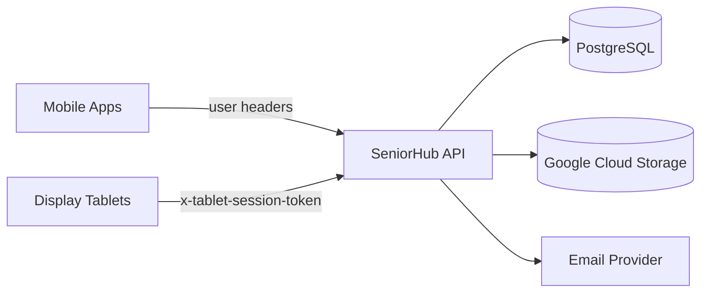
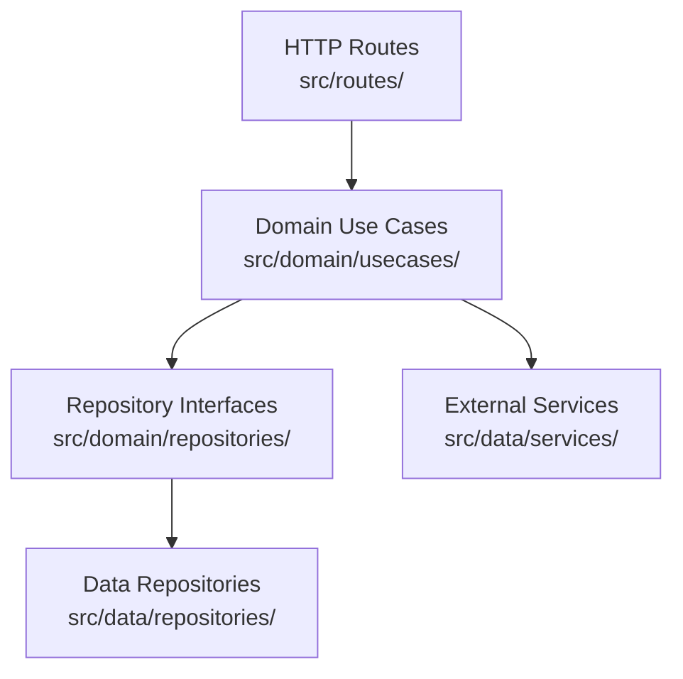
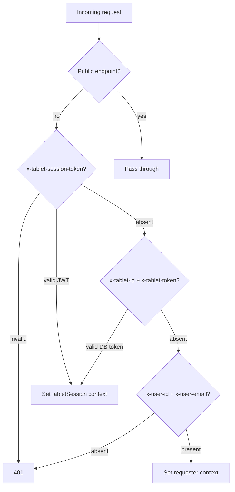
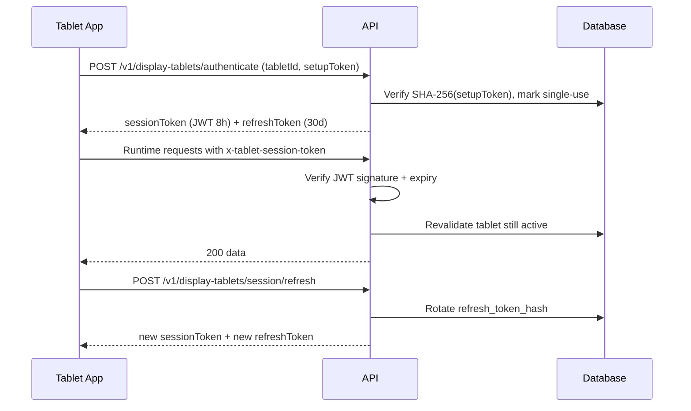
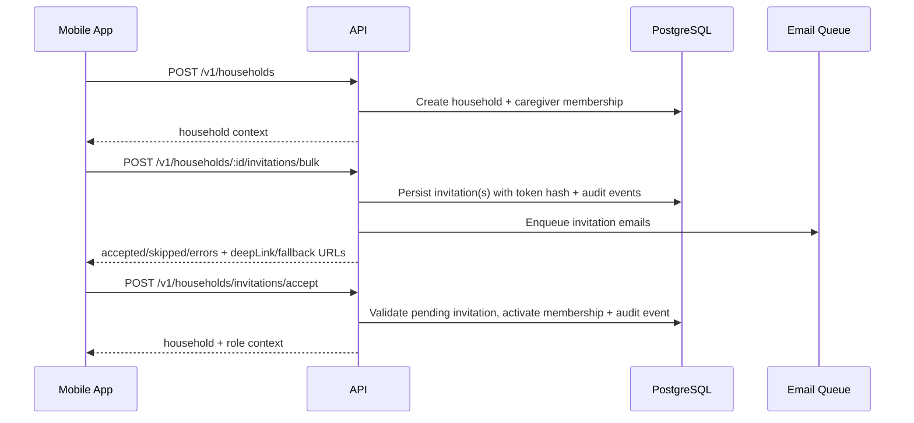
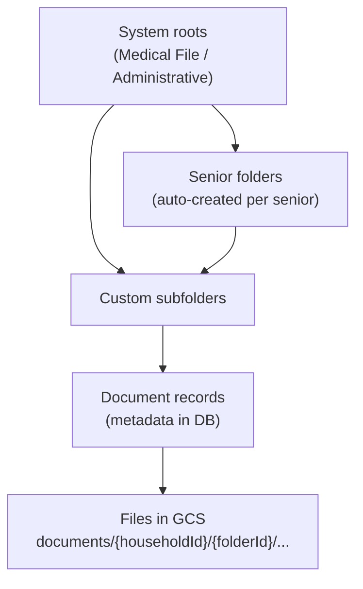
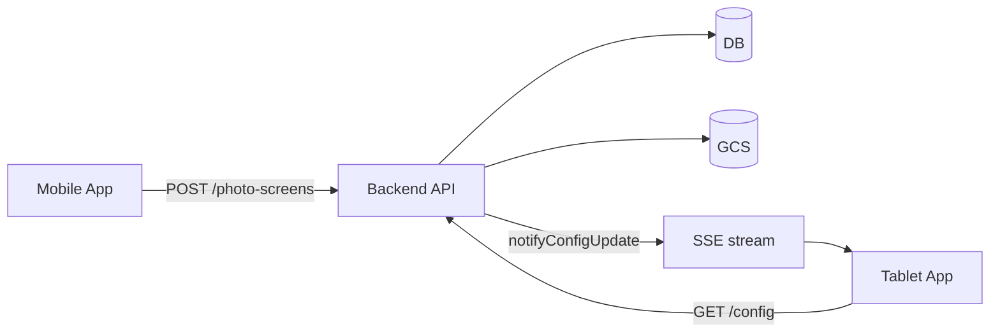

# ARCHITECTURE.md

> Technical source of truth for `seniorhub-backend`.
> Any structural change must be reflected here in the same work cycle.

## 1. Technical vision

`seniorhub` is a backend platform that powers data sharing across members of the same household (senior, caregiver, relatives, trusted contacts) and drives read-only display tablets with real-time updates.

## 2. Core principles

- Strict layer separation (`api` → `domain` → `data`)
- Domain-driven business rules for access and sharing
- Explicit household scoping for all sensitive resources
- Testability and maintainability from day one
- Secure-by-default design for personal/health-related data

## 3. System context


```mermaid
flowchart LR
  Mobile[Mobile Apps]
  Tablet[Display Tablets]
  API[SeniorHub API]
  DB[(PostgreSQL)]
  GCS[(Google Cloud Storage)]
  Email[Email Provider]

  Mobile -->|user headers| API
  Tablet -->|x-tablet-session-token| API
  API --> DB
  API --> GCS
  API --> Email
```

## 4. Layered architecture


```mermaid
flowchart TB
  Routes[HTTP Routes\nsrc/routes/]
  UseCases[Domain Use Cases\nsrc/domain/usecases/]
  Ports[Repository Interfaces\nsrc/domain/repositories/]
  DataRepos[Data Repositories\nsrc/data/repositories/]
  Services[External Services\nsrc/data/services/]

  Routes --> UseCases
  UseCases --> Ports
  Ports --> DataRepos
  UseCases --> Services
```

### 4.1 Layer responsibilities

| Layer | Path | Role |
|-------|------|------|
| `routes` | `src/routes/` | Transport only: HTTP parse, Zod validation, DTO mapping. No business rules. |
| `domain/usecases` | `src/domain/usecases/` | Access control decisions and business orchestration. |
| `domain/repositories` | `src/domain/repositories/` | Abstract ports for persistence. |
| `domain/entities` | `src/domain/entities/` | Pure TypeScript interfaces for domain objects. |
| `domain/errors` | `src/domain/errors/` | Typed error classes mapped to HTTP codes. |
| `data/repositories` | `src/data/repositories/` | Concrete PostgreSQL and in-memory implementations. |
| `data/services` | `src/data/services/` | Email providers and storage service (GCS). |

### 4.2 Contract and DTO policy

- Request and response DTOs must be explicit and stable.
- Contract changes must be documented in `CHANGELOG.md`.
- Sensitive fields must never be returned unless explicitly required and authorized.

## 5. Functional domains

| Domain | Use case folder | Description |
|--------|----------------|-------------|
| `households` | `usecases/households/` | Household CRUD, overview, member management |
| `invitations` | `usecases/invitations/` | Invitation lifecycle: bulk create, accept, cancel, resend |
| `appointments` | `usecases/appointments/` | Appointments with recurrence, individual occurrence overrides |
| `medications` | `usecases/medications/` | Medications + autocomplete |
| `reminders` | `usecases/reminders/` | Medication reminders |
| `tasks` | `usecases/tasks/` | Tasks with completion tracking |
| `displayTablets` | `usecases/displayTablets/` | Tablet lifecycle, auth, config, SSE |
| `photoScreens` | `usecases/photoScreens/` | Photo gallery screens per tablet |
| `photos` | `usecases/photos/` | Photo upload, update, delete, reorder |
| `documents` | `usecases/documents/` | Hierarchical document/folder storage (GCS) |
| `privacySettings` | `usecases/privacySettings/` | Per-user privacy configuration |

## 6. Authentication model

Two distinct authentication paths exist at the API layer (`src/plugins/authContext.ts`):


```mermaid
flowchart TD
  Request[Incoming request]
  TabletJWT{x-tablet-session-token?}
  TabletRaw{x-tablet-id + x-tablet-token?}
  UserHeaders{x-user-id + x-user-email?}
  Public{Public endpoint?}

  Request --> Public
  Public -->|yes| Allow[Pass through]
  Public -->|no| TabletJWT
  TabletJWT -->|valid JWT| TabletSession[Set tabletSession context]
  TabletJWT -->|invalid| Reject401[401]
  TabletJWT -->|absent| TabletRaw
  TabletRaw -->|valid DB token| TabletSession
  TabletRaw -->|absent| UserHeaders
  UserHeaders -->|present| UserContext[Set requester context]
  UserHeaders -->|absent| Reject401
```

### 6.1 User authentication

Headers required on all protected endpoints:
- `x-user-id`
- `x-user-email`
- `x-user-first-name`
- `x-user-last-name`

### 6.2 Display tablet authentication

Three credentials with distinct roles:

| Credential | Header | Lifetime | Purpose |
|-----------|--------|----------|---------|
| Setup token | Body of `POST /v1/display-tablets/authenticate` | 72h, single-use | Initial pairing via QR code |
| Session token (JWT) | `x-tablet-session-token` | 8h | All runtime tablet requests |
| Refresh token | Body of `POST /v1/display-tablets/session/refresh` | 30 days, rotates | Renew session token |


```mermaid
sequenceDiagram
  participant T as Tablet App
  participant API as API
  participant DB as Database

  T->>API: POST /v1/display-tablets/authenticate (tabletId, setupToken)
  API->>DB: Verify SHA-256(setupToken), mark single-use
  API-->>T: sessionToken (JWT 8h) + refreshToken (30d)

  T->>API: Runtime requests with x-tablet-session-token
  API->>API: Verify JWT signature + expiry
  API->>DB: Revalidate tablet still active
  API-->>T: 200 data

  T->>API: POST /v1/display-tablets/session/refresh
  API->>DB: Rotate refresh_token_hash
  API-->>T: new sessionToken + new refreshToken
```

See `docs/TABLET_AUTHENTICATION_FLOW.md` for full details.

## 7. Onboarding sequence (household → invite → accept)


```mermaid
sequenceDiagram
  participant M as Mobile App
  participant API as API
  participant DB as PostgreSQL
  participant Q as Email Queue

  M->>API: POST /v1/households
  API->>DB: Create household + caregiver membership
  API-->>M: household context

  M->>API: POST /v1/households/:id/invitations/bulk
  API->>DB: Persist invitation(s) with token hash + audit events
  API->>Q: Enqueue invitation emails
  API-->>M: accepted/skipped/errors + deepLink/fallback URLs

  M->>API: POST /v1/households/invitations/accept
  API->>DB: Validate pending invitation, activate membership + audit event
  API-->>M: household + role context
```

## 8. Document system

The documents domain provides a hierarchical folder and file storage system backed by Google Cloud Storage.


```mermaid
flowchart TD
  Roots["System roots\n(Medical File / Administrative)"]
  Senior["Senior folders\n(auto-created per senior)"]
  Custom["Custom subfolders"]
  Docs["Document records\n(metadata in DB)"]
  GCS["Files in GCS\ndocuments/{householdId}/{folderId}/..."]

  Roots --> Senior
  Roots --> Custom
  Senior --> Custom
  Custom --> Docs
  Docs --> GCS
```

Key rules:
- `viewDocuments` permission required to read; `manageDocuments` to write.
- Senior-specific folders are auto-created under Medical File when a senior joins.
- System root folders cannot be renamed or deleted.
- Display tablets have `viewDocuments` automatically; write operations are blocked.

See `docs/DOCUMENTS_SYSTEM.md` for full spec and API table.

## 9. Photo screens (display tablets)


```mermaid
flowchart LR
  Mobile[Mobile App]
  BE[Backend API]
  DB[(DB)]
  GCS[(GCS)]
  SSE[SSE stream]
  Tablet[Tablet App]

  Mobile -->|POST /photo-screens| BE
  BE --> DB
  BE --> GCS
  BE -->|notifyConfigUpdate| SSE
  SSE --> Tablet
  Tablet -->|GET /config| BE
```

- Max 5 photo screens per tablet, 6 photos per screen.
- Photo upload: JPEG/PNG/WebP, 5 MB max, compressed to ~1 MB via Sharp.
- SSE event `config-updated` triggers tablet to re-fetch `GET /config`.
- See `docs/PHOTO_SCREENS_FEATURE.md` and `docs/TABLET_PHOTO_SCREENS_INTEGRATION.md`.

## 10. Route module structure

```
src/routes/households/
├── index.ts                      # Plugin entry point, dependency injection
├── schemas.ts                    # Shared Zod + JSON Schema definitions
├── utils.ts                      # Shared utilities (tablet access check, requester context)
├── householdRoutes.ts            # Household CRUD + member management
├── invitationRoutes.ts           # Invitation lifecycle
├── appointmentRoutes.ts          # Appointments + occurrence overrides
├── appointmentSchemas.ts
├── medicationRoutes.ts           # Medications
├── medicationSchemas.ts
├── reminderRoutes.ts             # Medication reminders
├── taskRoutes.ts                 # Tasks
├── taskSchemas.ts
├── displayTabletRoutes.ts        # Display tablets, SSE, config
├── displayTabletConfigSchemas.ts
├── photoScreenRoutes.ts          # Photo screens + photo uploads
├── photoScreenSchemas.ts
├── documentRoutes.ts             # Documents and folders
├── documentSchemas.ts
├── observabilityRoutes.ts        # Email metrics
└── README.md
src/routes/
├── userProfileRoutes.ts          # User profile
├── privacySettingsRoutes.ts      # Privacy settings
├── medicationRoutes.ts           # Standalone medication autocomplete
└── errorHandler.ts               # Global domain-error-to-HTTP mapping
```

## 11. Use case organization

```
src/domain/usecases/
├── households/          # Household CRUD + member management (9 use cases)
├── invitations/         # Invitation lifecycle (9 use cases)
├── appointments/        # Appointments + occurrence management (10 use cases)
├── medications/         # Medications + autocomplete (5 use cases)
├── reminders/           # Medication reminders (4 use cases)
├── tasks/               # Tasks (8 use cases)
├── displayTablets/      # Tablet lifecycle + auth (9 use cases)
├── photoScreens/        # Photo screen CRUD (5 use cases)
├── photos/              # Photo management (4 use cases)
├── documents/           # Document folders + files (9 use cases)
├── privacySettings/     # Privacy settings (2 use cases)
└── shared/
    ├── HouseholdAccessValidator.ts   # ensureMember / ensureCaregiver
    └── index.ts
```

## 12. Repository structure

```
src/data/repositories/
├── postgres/
│   └── helpers.ts                    # Shared DB utilities (mappers, normalizers, date helpers)
├── PostgresHouseholdRepository.ts    # All domain data access (single large repository)
├── InMemoryHouseholdRepository.ts    # In-memory stub for tests
└── createHouseholdRepository.ts      # Driver switch (env: PERSISTENCE_DRIVER)
```

Persistence driver switch:
- `PERSISTENCE_DRIVER=postgres` → `PostgresHouseholdRepository`
- otherwise → `InMemoryHouseholdRepository` (default for local dev without DB)

## 13. Domain error handling

```
src/domain/errors/
├── DomainErrors.ts    # Typed error classes
└── index.ts           # Public exports
```

| Error class | HTTP code | When to use |
|-------------|-----------|-------------|
| `NotFoundError` | 404 | Resource not found |
| `ForbiddenError` | 403 | Access denied |
| `ConflictError` | 409 | Uniqueness conflict |
| `ValidationError` | 400 | Invalid input |
| `BusinessRuleError` | 422 | Business rule violation |
| `MaxPhotoScreensReachedError` | 400 | Tablet photo screen limit (5) |
| `MaxPhotosReachedError` | 400 | Screen photo limit (6) |
| `UnsupportedFileFormatError` | 400 | Non-JPEG/PNG/WebP upload |
| `FileTooLargeError` | 400 | Upload > 5 MB |
| `PhotoScreenNotFoundError` | 404 | Photo screen not found |
| `PhotoNotFoundError` | 404 | Photo not found |

All errors are mapped to HTTP responses by `handleDomainError()` in `src/routes/errorHandler.ts`.

## 14. Storage services

```
src/data/services/storage/
├── GCSStorageService.ts     # Google Cloud Storage implementation
├── createStorageService.ts  # Factory (driver switch via env)
└── types.ts                 # StorageService interface
```

GCS path structure:
- **Photos**: `households/{householdId}/tablets/{tabletId}/photos/{photoId}.{ext}`
- **Documents**: `documents/{householdId}/{folderId}/{timestamp}_{originalFilename}`

## 15. Email services

```
src/data/services/email/
├── ResendEmailProvider.ts          # Production: Resend API
├── GmailSmtpProvider.ts            # Alternative: Gmail SMTP
├── ConsoleEmailProvider.ts         # Dev: logs to console
├── MailDevEmailProvider.ts         # Dev: local MailDev
├── InvitationEmailQueue.ts         # In-memory async queue
├── InvitationEmailMetrics.ts       # Delivery metrics counter
├── invitationEmailRuntime.ts       # Runtime provider selection
└── types.ts                        # EmailProvider interface
```

Provider selection via `EMAIL_PROVIDER` env variable: `resend` | `gmail` | `console` | `maildev`.

## 16. Database migrations

Migrations are plain `.sql` files in `migrations/`. Applied in order by `npm run migrate`. Applied versions tracked in `schema_migrations`.

Notable milestones:
- `001–009`: Households, members, invitations, audit events
- `010`: Appointment occurrences
- `011–017`: Display tablets, tablet config, SSE
- `018`: Photo screens and photos
- `019–020`: User profile, privacy settings
- `021`: Document folders and documents

## 17. Observability

- OpenAPI: `GET /docs` (Swagger UI), `GET /documentation/json`
- Invitation email metrics: `GET /v1/observability/invitations/email-metrics`
- Audit events persisted in `audit_events` for invitation create/accept/cancel

## 18. Security constraints

- Every household resource access validates membership via `HouseholdAccessValidator`.
- No cross-household access is allowed.
- Display tablets are read-only; write operations are blocked at use-case level.
- Tablet `userId` is synthetic (`"tablet:{tabletId}"`); member checks are bypassed and replaced by route-level household validation.
- Sensitive fields must never appear in API responses unless explicitly required.
- All mutation endpoints validate payloads with Zod.
- Only hashes are stored for invitation tokens, setup tokens, and refresh tokens.

## 19. Quality constraints

```bash
npm run quality:check    # lint + typecheck + test
```

- Mutation endpoints must include explicit Zod validation.
- Household membership checks are mandatory in use-cases for protected resources.
- Unit tests required for sensitive business rules.
- Integration/e2e coverage for access-control critical flows.
